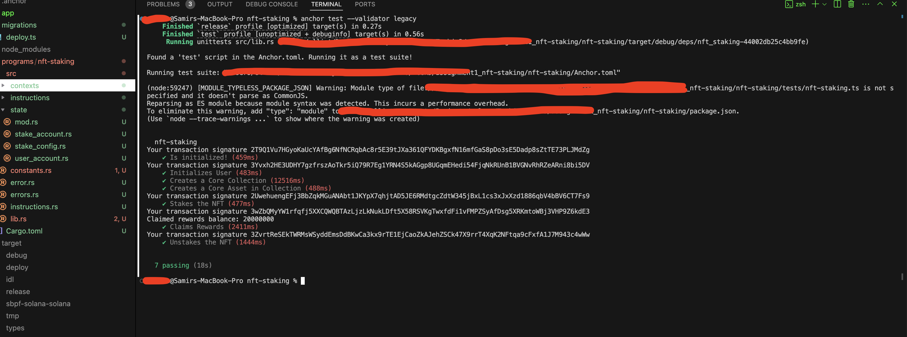

# 🏕️ Turbin3 NFT Staking Program

A robust Solana smart contract built with Anchor for staking NFTs. This program integrates with Metaplex Core (mpl-core) to seamlessly freeze assets upon staking and thaw them upon unstaking, while rewarding users for the time their NFTs are staked.



## 🌟 Features

- **NFT Staking**: Securely stake Metaplex Core NFTs.
- **Freeze/Thaw Mechanics**: Utilizes the `mpl-core` FreezeDelegate plugin. The NFT remains in the user's wallet but is frozen (cannot be transferred) while staked.
- **Time-Based Rewards**: Accumulate tokens based on how long the NFT is staked.
- **Flexible Unstaking**: Users can claim rewards and unstake their NFTs once the minimum freeze period has elapsed.

## 🏗️ Architecture & State

### **PDA Accounts**
- `StakeConfig`: Global configuration holding the freeze period, rewards per slot/second, and the rewards mint bump.
- `UserAccount`: Tracks the user's total staked NFTs and overall points/rewards.
- `StakeAccount`: Tracks individual NFT stakes, recording the exact time of staking.

### **Metaplex Core Integration**
This program interacts with `mpl-core` via raw CPI instructions to:
- `AddPluginV1`: Attaches a `FreezeDelegate` to the NFT during staking.
- `UpdatePluginV1`: Sets the frozen status to `false` during unstaking.
- `RemovePluginV1`: Removes the plugin once unstaked.

## 🚀 Getting Started

### Prerequisites

- [Rust](https://rustup.rs/) (v1.75.0 or later)
- [Solana CLI](https://docs.solana.com/cli/install-solana-cli-tools) (v1.18.x)
- [Anchor CLI](https://www.anchor-lang.com/docs/installation) (v0.29.0 or later)
- Node.js & Yarn

### Installation

1. **Clone the repository:**
   ```bash
   git clone https://github.com/SAMIR897/assignment1_nft-staking.git
   cd assignment1_nft-staking/nft-staking
   ```

2. **Install dependencies:**
   ```bash
   yarn install
   ```

3. **Build the program:**
   ```bash
   anchor build
   ```

## 🧪 Testing

The test suite runs through the entire lifecycle: initializing the program, setting up a user, creating a Metaplex Core Collection & Asset, staking the asset, claiming rewards, and finally unstaking.

Run the tests using a local ledger:

```bash
anchor test --validator legacy
```

### Test Coverage:
- `✔ Is initialized!`
- `✔ Initializes User`
- `✔ Creates a Core Collection`
- `✔ Creates a Core Asset in Collection`
- `✔ Stakes the NFT`
- `✔ Claims Rewards`
- `✔ Unstakes the NFT`

## 📜 License

This project is licensed under the MIT License.
